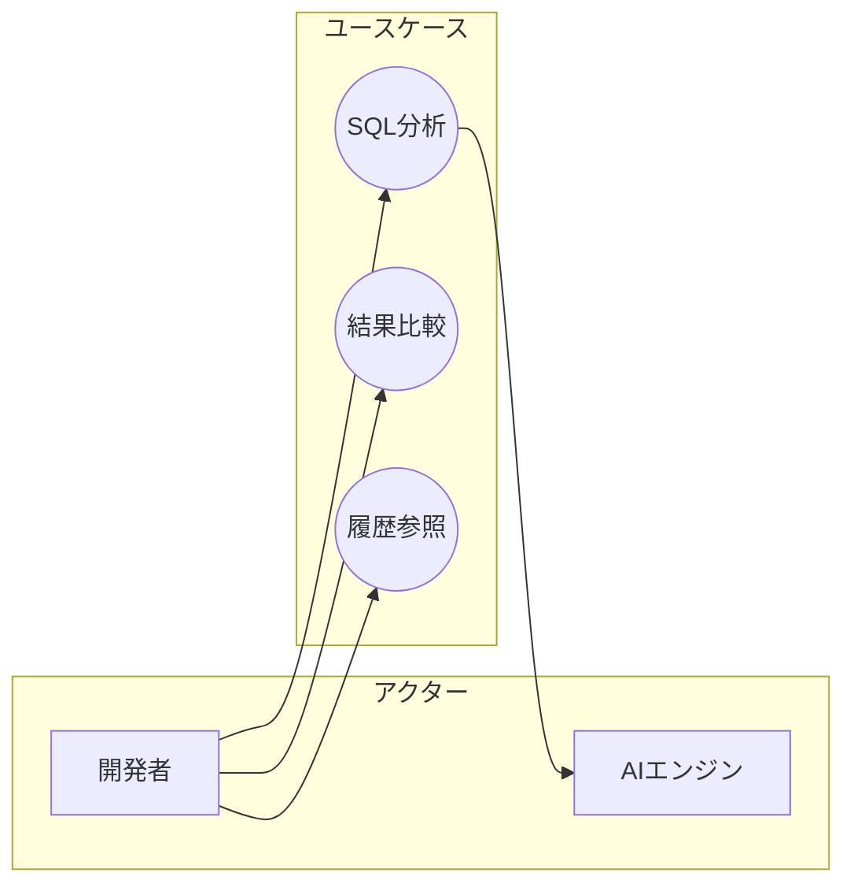

# ユースケース記述

## 目次

- [概要](#概要)
- [参照ドキュメント](#参照ドキュメント)
- [ワークフロー](#ワークフロー)
  - [フェーズ1: ストーリーをユースケースに束ねる](#フェーズ1-ストーリーをユースケースに束ねる)
  - [フェーズ2: アクターの特定](#フェーズ2-アクターの特定)
  - [フェーズ3: 正常系フローの記述](#フェーズ3-正常系フローの記述)
  - [フェーズ4: 事前条件・事後条件の定義](#フェーズ4-事前条件事後条件の定義)
  - [フェーズ5: 代替フローの洗い出し](#フェーズ5-代替フローの洗い出し)
  - [フェーズ6: 異常系（例外フロー）の洗い出し](#フェーズ6-異常系例外フローの洗い出し)
  - [フェーズ7: ビジネスルールの抽出](#フェーズ7-ビジネスルールの抽出)
  - [フェーズ8: 受け入れ基準の定義](#フェーズ8-受け入れ基準の定義)
  - [フェーズ9: ドキュメント生成](#フェーズ9-ドキュメント生成)
  - [出力ファイル](#出力ファイル)
  - [フェーズ10: ユースケース図の生成（オプション）](#フェーズ10-ユースケース図の生成オプション)
  - [フェーズ11: セルフレビュー（サブエージェント）](#フェーズ11-セルフレビューサブエージェント)
- [完了条件](#完了条件)
- [関連スキル](#関連スキル)

## 概要

ユーザーストーリーをユースケースに束ねて詳細化し、以下を生成する：
1. ユースケース記述（正常系/異常系/代替フロー）
2. ビジネスルール一覧
3. 受け入れ基準（各行の先頭に、それが満たすストーリーの番号を付ける）
4. ユースケース図（Mermaid）
5. USER_STORIES.md の各ストーリーへの「実現するユースケース」の書き戻し

受け入れ基準をユースケースに置くのは、下流の追跡単位がユースケースだからである。親 issue はユースケース 1 件につき 1 件作られ、機能設計書は「対象 UC」でユースケースを指す。ストーリーとユースケースは多対多になるので、ストーリー側に基準を置くと、ユースケース 1 件の検証条件を複数のストーリーから集めることになる。

## 参照ドキュメント

- **ユースケース記述ガイド**: [usecase-guide.md](usecase-guide.md)
  - 読み込みタイミング: フェーズ3で正常系フローを記述する時と、フェーズ8で受け入れ基準を書く時

## ワークフロー

フェーズ1で決めたユースケースごとに、フェーズ2〜8を繰り返す。

### フェーズ1: ストーリーをユースケースに束ねる

すべてのユーザーストーリーを、それを実現するユースケースに割り当てる。ユースケースで実現しないストーリーは作らない。静的ページを読むだけのストーリーも、閲覧のユースケースにする。

#### 1.1 前提ドキュメントの読み込み

```javascript
Read({ file_path: "docs/design/USER_STORIES.md" })
```

#### 1.2 束ね方の決定

**ファイルが存在する場合**:
USER_STORIES.md の `#### US-<番号>` 見出しをすべて読み込み、ユースケースへの束ね方の案を作って確認する。Won't の表にあるストーリーは対象外。

束ねる基準は「同じトリガーと事後条件を持つストーリーの束」とする。主アクターは合わせてよい（例: ゲストの「空車と総額を確認する」と会員の「マイレージを使う」は、どちらも「借りたい日時が決まって金額を知りたい」をトリガーとし、「総額を把握している」で終わるので 1 つのユースケースにする）。1 つのストーリーが複数のユースケースにまたがってもよい。

```javascript
AskUserQuestion({
  questions: [
    {
      question: "ユーザーストーリーを次のユースケースに束ねます。この案で進めてよいですか？\n\nUC-001: <名前> ← US-001, US-002\nUC-002: <名前> ← US-003\n...",
      header: "束ね方",
      options: [
        { label: "この案で進める", description: "全ストーリーがいずれかのユースケースに割り当てられている" },
        { label: "修正する", description: "束ね方・ユースケース名の修正を入力する" }
      ],
      multiSelect: false
    }
  ]
})
```

**遷移条件**: 全ストーリーがいずれかのユースケースに割り当てられたらフェーズ2へ

**ファイルが存在しない場合**:
AskUserQuestionで詳細化する内容を確認する。この場合はストーリー番号が無いので、受け入れ基準に `（US-<番号>）` の接頭辞を付けず、フェーズ9の書き戻しとフェーズ11の被覆チェックも行わない。

```javascript
AskUserQuestion({
  questions: [
    {
      question: "詳細化したいユーザーストーリーを入力してください。",
      header: "対象ストーリー",
      options: [
        { label: "ストーリーを入力", description: "詳細化したいストーリーを記述" }
      ],
      multiSelect: false
    }
  ]
})
```

**遷移条件**: 対象ストーリーが特定できたらフェーズ2へ

### フェーズ2: アクターの特定

ユースケースに関わるアクターを洗い出す。

```javascript
AskUserQuestion({
  questions: [
    {
      question: "このユースケースに関わるアクター（人、システム）は誰ですか？",
      header: "アクター",
      options: [
        { label: "アクターを入力", description: "例: 開発者、AIエンジン、外部DB" }
      ],
      multiSelect: false
    }
  ]
})
```

#### アクターの種類

| 種類           | 説明                   | 例                       |
| -------------- | ---------------------- | ------------------------ |
| **主アクター** | ユースケースを開始する | 開発者                   |
| **副アクター** | ユースケースに協力する | AIエンジン、決済システム |

**遷移条件**: アクターが特定できたらフェーズ3へ

### フェーズ3: 正常系フローの記述

ユースケースの基本フロー（ハッピーパス）を記述する。

**質問パターン**:
- 「最初に何をしますか？」
- 「次に何が起こりますか？」
- 「システムはどう応答しますか？」
- 「最終的にどうなったら成功ですか？」

```javascript
AskUserQuestion({
  questions: [
    {
      question: "このユースケースの正常な流れをステップバイステップで教えてください。",
      header: "正常系フロー",
      options: [
        { label: "フローを入力", description: "1. xxx 2. xxx 3. xxx" }
      ],
      multiSelect: false
    }
  ]
})
```

#### フロー記述のフォーマット

```
1. [アクター] が [アクション] する
2. [システム] が [応答/処理] する
3. [アクター] が [アクション] する
4. [システム] が [結果] を表示する
```

**例**:
```
1. 開発者がSQLを入力する
2. 開発者がスキーマを入力する
3. 開発者が「分析」ボタンをクリックする
4. システムがAIエンジンに改善案を要求する
5. AIエンジンが改善案を3つ返す
6. システムが改善案を一覧表示する
```

**遷移条件**: 正常系フローが5-10ステップで記述できたらフェーズ4へ

### フェーズ4: 事前条件・事後条件の定義

ユースケースの開始条件と終了状態を明確にする。

```javascript
AskUserQuestion({
  questions: [
    {
      question: "このユースケースを開始するための条件は？（事前条件）",
      header: "事前条件",
      options: [
        { label: "条件を入力", description: "例: ログイン済み、プロジェクトを選択済み" }
      ],
      multiSelect: false
    },
    {
      question: "このユースケースが成功した後の状態は？（事後条件）",
      header: "事後条件",
      options: [
        { label: "状態を入力", description: "例: 改善案が保存されている" }
      ],
      multiSelect: false
    }
  ]
})
```

**遷移条件**: 事前・事後条件が定義できたらフェーズ5へ

### フェーズ5: 代替フローの洗い出し

正常系から分岐するパスを特定する。

**質問パターン**:
- 「ステップXで別の選択肢はありますか？」
- 「ユーザーが途中でキャンセルしたらどうなりますか？」
- 「複数の方法がある場合は？」

```javascript
AskUserQuestion({
  questions: [
    {
      question: "正常系の各ステップで、別の選択肢や分岐はありますか？",
      header: "代替フロー",
      options: [
        { label: "代替フローを入力", description: "ステップX: 〇〇の場合は△△する" }
      ],
      multiSelect: false
    }
  ]
})
```

**例**:
```
代替フロー A: ステップ2でスキーマをファイルからインポート
2a. 開発者が「インポート」ボタンをクリックする
2b. システムがファイル選択ダイアログを表示する
2c. 開発者がDDLファイルを選択する
2d. システムがスキーマをパースして入力欄に反映する
→ ステップ3に戻る
```

**遷移条件**: 主要な代替フローが洗い出せたらフェーズ6へ

### フェーズ6: 異常系（例外フロー）の洗い出し

エラーや例外的な状況を特定する。

**質問パターン**:
- 「ステップXで失敗したらどうなりますか？」
- 「入力が不正だった場合は？」
- 「外部システムが応答しなかったら？」
- 「タイムアウトしたらどうなりますか？」

```javascript
AskUserQuestion({
  questions: [
    {
      question: "どんなエラーや例外が発生し得ますか？それぞれどう対処しますか？",
      header: "異常系",
      options: [
        { label: "異常系を入力", description: "エラー: 〇〇 → 対処: △△" }
      ],
      multiSelect: false
    }
  ]
})
```

**例**:
```
例外フロー E1: ステップ4でAIエンジンがタイムアウト
4a. システムが30秒待ってもAIから応答がない
4b. システムが「処理に時間がかかっています」と表示する
4c. システムがバックグラウンドで処理を継続する
4d. 完了したらメールで通知する
```

**遷移条件**: 主要な異常系が洗い出せたらフェーズ7へ

### フェーズ7: ビジネスルールの抽出

フローの中に隠れているビジネスルールを明確にする。

**質問パターン**:
- 「〇〇できる条件は何ですか？」
- 「上限や下限はありますか？」
- 「〇〇と△△の関係にルールはありますか？」
- 「自動的に行われる処理はありますか？」

```javascript
AskUserQuestion({
  questions: [
    {
      question: "このユースケースに関連するビジネスルールや制約はありますか？",
      header: "ビジネスルール",
      options: [
        { label: "ルールを入力", description: "例: 1回の分析で最大10クエリまで" }
      ],
      multiSelect: false
    }
  ]
})
```

**例**:
```
BR-001: 1回の分析で入力できるSQLは最大10クエリまで
BR-002: スキーマサイズは100KB以下
BR-003: 改善案は最低3つ、最大10個生成する
BR-004: 無料プランは1日5回まで分析可能
```

**遷移条件**: ビジネスルールが整理できたらフェーズ8へ

### フェーズ8: 受け入れ基準の定義

このユースケースが終わったと言える条件を、チェックリストで書く。書式・起こし方・接頭辞の規則は [usecase-guide.md](usecase-guide.md)「受け入れ基準」に従う。

新しく聞き取るのではなく、ここまでに書いた正常系・代替・例外フローとビジネスルールから候補を起こし、まとめて提示して確認する。フローと BR から起こせない基準が要るなら、フローか BR の方が欠けている合図なので、そちらを先に直す。

各行の先頭には、その基準が満たすストーリーの番号を `（US-<番号>）` の形で付ける。フェーズ1でこのユースケースに割り当てたストーリーは、少なくとも 1 行に現れること。

```javascript
AskUserQuestion({
  questions: [
    {
      question: "フローとビジネスルールから、次の受け入れ基準を起こしました。この内容でよいですか？\n\n- [ ] （US-001）...\n- [ ] （US-001）...\n- [ ] （US-002）...",
      header: "受け入れ基準",
      options: [
        { label: "この内容で進める", description: "割り当てた全ストーリーが 1 行以上に現れている" },
        { label: "修正する", description: "追加・削除・言い換えを入力する" }
      ],
      multiSelect: false
    }
  ]
})
```

**遷移条件**: 割り当てた全ストーリーが受け入れ基準に現れたら、次のユースケースのフェーズ2へ。全ユースケースが終わったらフェーズ9へ

### フェーズ9: ドキュメント生成

テンプレートは [usecase-template.md](usecase-template.md) を参照。

### 出力ファイル

```javascript
Write({
  file_path: "docs/design/USECASES.md",
  content: usecasesContent
})
```

続けて USER_STORIES.md の各ストーリーに、それを実現するユースケースを書き戻す。挿入する位置は各ストーリーの `**エピック**` 行の直前で、既に行があれば置き換える。ストーリーからユースケースへの参照はこの 1 行だけにし、ユースケース側にはストーリーの一覧を書かない（両方に書くと食い違う）。

```markdown
#### US-001: SQLを入力できる

- **開発者として**
- **SQLとスキーマを入力したい**
- **なぜなら** 改善案を得られるから

**実現するユースケース**: UC-001

**エピック**: クエリ最適化機能
```

複数のユースケースで実現するストーリーは `UC-002・UC-004` のように中黒でつなぐ。USER_STORIES.md が無い場合は書き戻しを行わない。

### フェーズ10: ユースケース図の生成（オプション）



### フェーズ11: セルフレビュー（サブエージェント）

生成したドキュメントのレビューをサブエージェントに委譲する。

```javascript
Agent({
  description: "ユースケースレビュー",
  subagent_type: "general-purpose",
  prompt: `
以下のユースケースドキュメントをレビューし、問題があれば修正してください。

## レビュー対象ファイル
- docs/design/USECASES.md
- docs/design/USER_STORIES.md（「実現するユースケース」行の確認のみ。ストーリー本文は修正しない）

## レビュー観点

1. **正常系の完全性**: フローが開始から終了まで漏れなく記述されているか
2. **代替フローの網羅性**: 主要な分岐パスが洗い出されているか
3. **異常系の網羅性**: エラーケースが十分に考慮されているか
4. **ビジネスルールの明確さ**: 制約や条件が具体的に定義されているか
5. **事前・事後条件の妥当性**: 開始条件と終了状態が明確で矛盾がないか
6. **アクターの適切さ**: 主アクター・副アクターが適切に定義されているか
7. **受け入れ基準の具体性**: 各項目が 1 文で「どんなときに・何をすると・どうなるか」を読み取れるか。前提条件と操作と期待結果が別々の行に分かれて書かれていないか。フローまたは BR のどこから起こしたかが辿れるか
8. **受け入れ基準の被覆**: 次の 2 つのコマンドを実行し、結果を報告に含める（USER_STORIES.md が無い構成では実行しない）

\`\`\`bash
# 全ストーリーが受け入れ基準の行に現れること（出力 0 行で合格）
for id in $(rg -o '^#### (US-[0-9]+)' -r '$1' docs/design/USER_STORIES.md); do
  rg -q "^- \\[ \\] （$id）" docs/design/USECASES.md || echo "NG $id: 受け入れ基準に現れない"
done
# 全ストーリーに「実現するユースケース」行があること（2 つの件数が一致で合格）
rg -c '^#### US-' docs/design/USER_STORIES.md; rg -c '^\\*\\*実現するユースケース\\*\\*:' docs/design/USER_STORIES.md
\`\`\`

観点 8 で NG が出たストーリーは修正せず報告する。ユースケースを足すか、ストーリーを Won't へ移すかはユーザーが決める。

## 出力形式

1. 発見した問題のリスト（問題がない場合は「問題なし」）
2. 各問題の修正内容
3. 修正後のファイル更新（Editツールで修正）
4. 観点 8 のコマンド出力と、NG のストーリー一覧（なければ「被覆 OK」）

観点 1〜7 は問題がなくなるまでレビューと修正を繰り返すこと。
`
})
```

観点 8 で NG が報告されたら、親は AskUserQuestion で「ユースケースを足す（フェーズ2へ戻る）/ ストーリーを Won't へ移す」をストーリーごとに確認する。

## 完了条件

- [ ] 全ストーリーがいずれかのユースケースに割り当てられている
- [ ] アクターが特定されている
- [ ] 正常系フローが記述されている
- [ ] 事前・事後条件が定義されている
- [ ] 代替フローが洗い出されている
- [ ] 異常系が洗い出されている
- [ ] ビジネスルールが抽出されている
- [ ] 各ユースケースに受け入れ基準がある
- [ ] 全ストーリーが受け入れ基準に現れている（被覆チェックの出力が 0 行）
- [ ] USECASES.mdが生成されている
- [ ] USER_STORIES.md の全ストーリーに「実現するユースケース」行が書き戻されている
- [ ] セルフレビューが完了し、問題が解消されている

## 関連スキル

- **user-story**: ユースケース記述の前にストーリーを作成する場合
- **design-doc**: 横断設計に進む場合
- **feature-doc**: 受け入れ基準を機能設計書のテスト方針に割り当てる場合
