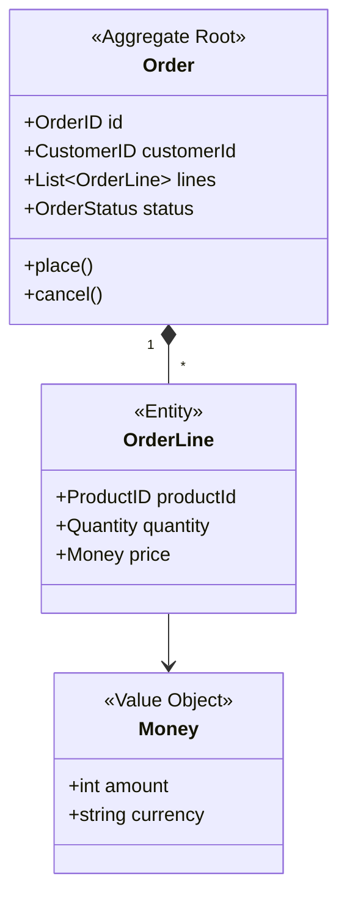

# DDDモデリング

## 概要

質問主導の対話でドメインを探索し、以下を生成する：
1. 用語集（ユビキタス言語）
2. ドメインモデル図（Mermaid）

## 参照ドキュメント

- **DDDパターン**: [references/ddd-patterns.md](references/ddd-patterns.md)
  - 読み込みタイミング: フェーズ4（モデル構築）でエンティティ/値オブジェクト/集約の判定時

## 質問のプレースホルダーについて

ワークフロー内の質問例で使用している「〇〇」「△△」は、対話中に収集した具体的な用語に置き換える。例えば、ユーザーが「注文」という用語を挙げた場合、「〇〇は一意に識別される必要がありますか？」は「注文は一意に識別される必要がありますか？」となる。

## ワークフロー

### フェーズ0: 前提ドキュメントの読み込み

前のステップの出力ファイルを読み込む。

#### 読み込み対象
- `docs/USECASES.md`
- `docs/FEASIBILITY.md`
- `docs/USER_STORIES.md`

```javascript
Read({ file_path: "docs/USECASES.md" })
Read({ file_path: "docs/FEASIBILITY.md" })
Read({ file_path: "docs/USER_STORIES.md" })
```

#### ファイルが存在する場合

読み込んだ内容から以下を抽出：
- ユースケースのアクター（エンティティ候補）
- ビジネスルール（ドメインロジック候補）
- 用語（ユビキタス言語候補）

**遷移条件**: フェーズ1へ（ドメイン概要把握を効率化）

#### ファイルが存在しない場合

フェーズ1でAskUserQuestionを使ってドメインを確認。

**遷移条件**: フェーズ1へ

### フェーズ1: ドメインの概要把握

対象ドメインの全体像を理解する。

**注**: フェーズ0で前提ドキュメントを読み込み済みの場合、それらの情報を元にドメイン概要を確認・補完する。

```javascript
AskUserQuestion({
  questions: [
    {
      question: "どのようなビジネス/システムのドメインをモデリングしますか？",
      header: "ドメイン",
      options: [
        { label: "ドメインを入力", description: "対象ドメインの概要を記述" }
      ],
      multiSelect: false
    },
    {
      question: "このドメインで最も重要なビジネス上の関心事は何ですか？",
      header: "関心事",
      options: [
        { label: "関心事を入力", description: "解決したい課題や重要な機能" }
      ],
      multiSelect: false
    }
  ]
})
```

**遷移条件**: ドメインの概要と主要な関心事が把握できたらフェーズ2へ

### フェーズ2: ユビキタス言語の収集

ドメインで使われる用語を洗い出す。

**質問パターン:**
- 「この業務で日常的に使われる言葉は何ですか？」
- 「〇〇という言葉の正確な意味を教えてください」
- 「〇〇と△△の違いは何ですか？」
- 「この概念に別の呼び方はありますか？」

```javascript
AskUserQuestion({
  questions: [
    {
      question: "このドメインで頻繁に使われる重要な用語を挙げてください（カンマ区切り）",
      header: "用語リスト",
      options: [
        { label: "用語を入力", description: "例: 注文, 顧客, 商品, 在庫" }
      ],
      multiSelect: false
    }
  ]
})
```

収集した用語それぞれについて深堀り：
- 定義の確認
- 関連する用語との関係
- ビジネスルールの有無

**遷移条件**: 主要な用語（5〜15個程度）が収集され、各用語の定義が明確になったらフェーズ3へ

### フェーズ3: 境界づけられたコンテキストの特定

同じ用語でも文脈によって意味が異なるケースを特定する。

**確認ポイント:**
- 同じ言葉が部署/チームによって異なる意味で使われていないか
- システムのどの部分でその用語が使われるか
- 用語の責任範囲はどこまでか

```javascript
AskUserQuestion({
  questions: [
    {
      question: "「〇〇」という用語は、異なる場面で異なる意味を持ちますか？",
      header: "文脈確認",
      options: [
        { label: "はい", description: "文脈によって意味が異なる" },
        { label: "いいえ", description: "一貫した意味で使われる" }
      ],
      multiSelect: false
    }
  ]
})
```

**遷移条件**: コンテキスト境界が明確になり、各用語がどのコンテキストに属するか整理できたらフェーズ4へ

### フェーズ4: ドメインモデルの構築

収集した情報からモデル要素を特定する。

#### 4.1 エンティティの特定

**判定基準:**
- 一意の識別子を持つか
- ライフサイクルを通じて同一性を保つか
- 状態が変化するか

```javascript
AskUserQuestion({
  questions: [
    {
      question: "〇〇は一意に識別される必要がありますか？（例: 注文番号で識別）",
      header: "識別子",
      options: [
        { label: "はい", description: "一意のIDで管理される" },
        { label: "いいえ", description: "値で比較すれば十分" }
      ],
      multiSelect: false
    }
  ]
})
```

#### 4.2 値オブジェクトの特定

**判定基準:**
- 属性の組み合わせで等価性を判断するか
- 不変か
- 他のエンティティの属性として使われるか

#### 4.3 集約の特定

**判定基準:**
- 一貫性を保つ必要があるエンティティのまとまりは何か
- トランザクション境界はどこか
- 集約ルートは何か

```javascript
AskUserQuestion({
  questions: [
    {
      question: "〇〇を変更するとき、必ず一緒に更新が必要なものはありますか？",
      header: "整合性",
      options: [
        { label: "あり", description: "関連するものを入力" },
        { label: "なし", description: "単独で更新可能" }
      ],
      multiSelect: false
    }
  ]
})
```

#### 4.4 ドメインイベントの特定

**質問パターン:**
- 「〇〇が起きたとき、他に何が起こりますか？」
- 「この変更を他のシステムに通知する必要がありますか？」

**遷移条件**: 以下がすべて特定できたらフェーズ5へ
- エンティティと値オブジェクトの分類
- 集約とその境界
- 主要なドメインイベント

### フェーズ5: 検証と確認

構築したモデルをユーザーと確認する。

```
## 確認事項

1. 用語の定義は正確か
2. エンティティと値オブジェクトの分類は適切か
3. 集約の境界は妥当か
4. 見落としている概念はないか
```

**遷移条件**: ユーザーがモデルを承認したらフェーズ6へ。修正が必要な場合は該当フェーズに戻る

### フェーズ6: ドキュメント生成

確認が完了したら以下を生成する。

#### 6.1 用語集（GLOSSARY.md）

```markdown
# ユビキタス言語 - 用語集

## コンテキスト: [コンテキスト名]

| 用語 | 定義 | 関連用語 | 備考 |
|------|------|----------|------|
| 注文 | 顧客が商品を購入する意思表示 | 顧客, 商品 | OrderStatus参照 |
```

#### 6.2 ドメインモデル図（DOMAIN_MODEL.md）

Mermaid記法でクラス図を生成：



### 出力ファイル

```javascript
// 用語集
Write({
  file_path: "docs/GLOSSARY.md",
  content: glossaryContent
})

// ドメインモデル
Write({
  file_path: "docs/DOMAIN_MODEL.md",
  content: domainModelContent
})
```

### フェーズ7: セルフレビュー（サブエージェント）

生成したドキュメントのレビューをサブエージェントに委譲する。

```javascript
Task({
  description: "DDDモデルレビュー",
  subagent_type: "general-purpose",
  prompt: `
以下のDDDモデリング成果物をレビューし、問題があれば修正してください。

## レビュー対象ファイル
- docs/GLOSSARY.md（用語集）
- docs/DOMAIN_MODEL.md（ドメインモデル図）

## レビュー観点

1. **用語の一貫性**: 用語集とモデル図で同じ用語が使われているか
2. **モデルの完全性**: 重要な概念が漏れていないか
3. **境界の妥当性**: 集約の境界が適切か、責務が明確か
4. **ビジネスルール**: 重要なビジネスルールがモデルに反映されているか

## チェックリスト

**用語集（GLOSSARY.md）**
- すべての用語に明確な定義がある
- 関連用語が正しくリンクされている
- コンテキストごとに整理されている

**ドメインモデル図（DOMAIN_MODEL.md）**
- エンティティと値オブジェクトが正しく分類されている
- 集約ルートが明示されている
- 関連と多重度が正確
- ステレオタイプ（<<Entity>>, <<Value Object>>等）が付与されている

## 出力形式

1. 発見した問題のリスト（問題がない場合は「問題なし」）
2. 各問題の修正内容
3. 修正後のファイル更新（Editツールで修正）

問題がなくなるまでレビューと修正を繰り返すこと。
`
})
```

#### サブエージェントの結果処理

- **問題なし**: フェーズ完了、完了条件を満たす
- **問題あり・修正済み**: 修正内容を確認し、必要に応じてユーザーに報告
- **解決不能な問題**: AskUserQuestionツールでユーザーに確認

## 質問のコツ

### 良い質問の例

- 「〇〇の状態が変わるのはどんなときですか？」
- 「〇〇と△△の関係を教えてください」
- 「〇〇が〇〇であるとき、△△はどうなりますか？」
- 「このルールに例外はありますか？」

### 避けるべき質問

- 技術的な実装詳細を聞く（「DBのスキーマは？」）
- Yes/Noで終わる質問ばかり
- 複数の概念を一度に聞く

## 完了条件

- [ ] 主要な用語がすべて定義されている
- [ ] エンティティと値オブジェクトが分類されている
- [ ] 集約とその境界が明確になっている
- [ ] ドメインイベントが特定されている
- [ ] GLOSSARY.mdが生成されている
- [ ] DOMAIN_MODEL.mdが生成されている
- [ ] セルフレビューが完了し、問題が解消されている

## 関連スキル

- **analyzing-requirements**: 技術要件の詳細設計が必要な場合
- **planning-tasks**: 実装タスクの分解が必要な場合
