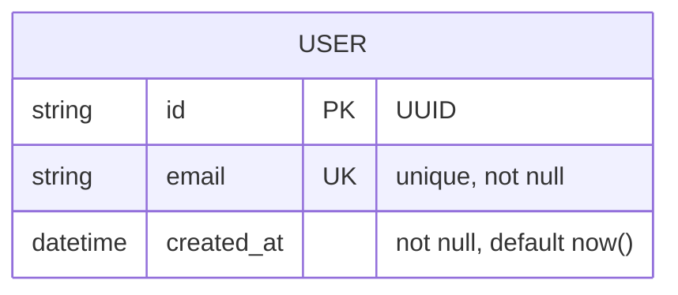
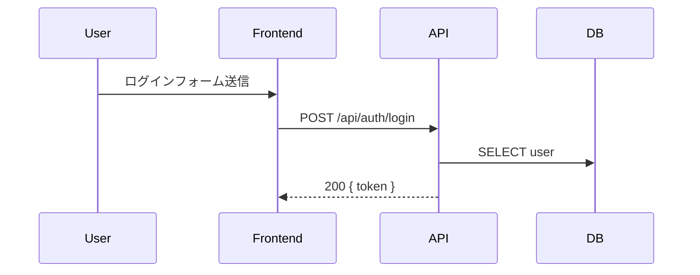

# DESIGN_DETAIL_APP.md テンプレート (アプリ詳細設計)

アプリケーション詳細設計ドキュメントを生成する際、以下のテンプレートを使用する。

## 責務

DESIGN_DETAIL_APP.md は「**どう実装するか**」を、開発者がこのファイルだけを見て実装を始められるレベルで書く。対象は**リポジトリ内のコード変更で完結するもの**すべて (API・スキーマ・エラー処理・テスト・UX)。IaC・クラウドコンソール操作・環境設定変更が要るものは `DESIGN_DETAIL_INFRA.md` の責務。

図はすべて **Mermaid** で書く (データフロー = `sequenceDiagram`、ER = `erDiagram`、画面遷移 = `flowchart`)。

## テンプレート

```markdown
# [プロジェクト名] アプリ詳細設計 (DESIGN_DETAIL_APP.md)

生成日: [日付]
ジェネレーター: dev-spec (analyzing-requirements)
概要設計: [DESIGN.md](./DESIGN.md) / インフラ詳細: [DESIGN_DETAIL_INFRA.md](./DESIGN_DETAIL_INFRA.md)

## 目次

- [1. プロジェクトセットアップ](#1-プロジェクトセットアップ)
- [2. 実装ガイド](#2-実装ガイド)
- [3. API 設計](#3-api-設計)
- [4. データスキーマ詳細](#4-データスキーマ詳細)
- [5. データフロー詳細](#5-データフロー詳細)
- [6. エラー戦略](#6-エラー戦略)
- [7. UX 設計](#7-ux-設計)
- [8. テスト戦略](#8-テスト戦略)
- [9. 検証手順](#9-検証手順)

## 1. プロジェクトセットアップ

[開発者 (または dev-impl フェーズ 1) がゼロから開発可能な状態を作る手順。コマンドは実行可能な形で書く]

### スキャフォールド

```bash
# 例: vite+ で React + TypeScript プロジェクトを作成し miniflare を追加
npm create vite-plus@latest [プロジェクト名] -- --template react-ts
cd [プロジェクト名]
npm install -D miniflare
```

### テンプレートの整理

- 削除するもの: [例: サンプルコンポーネント (`src/App.css`, `src/assets/`)、デモ用コード]
- 残すもの: [例: vite.config.ts、tsconfig の base 設定]
- 追加設定: [例: パスエイリアス、lint / formatter 設定]

### 初回起動確認

```bash
[dev サーバ起動コマンド]   # 例: npm run dev → http://localhost:5173 で初期画面表示
[テスト実行コマンド]       # 例: npm test → 0 件でも green で完走すること
```

## 2. 実装ガイド

### 採用パターン

[Repository / UseCase / Adapter 等。各パターンをどの層に適用するか]

### 使用ライブラリ

| ライブラリ | 用途   | バージョン制約                  |
| ---------- | ------ | ------------------------------- |
| [名前]     | [用途] | [制約があれば。無ければ latest] |

### ディレクトリ構造

```
src/
├── features/[機能名]/    # 実装・テスト・型のコロケーション
├── ...
```

## 3. API 設計

### エンドポイント一覧

| メソッド | パス            | 概要     | 認証 |
| -------- | --------------- | -------- | ---- |
| POST     | /api/auth/login | ログイン | 不要 |

### リクエスト / レスポンス仕様

[エンドポイントごとに具体的なスキーマを書く]

```json
// POST /api/auth/login
Request:  { "email": "user@example.com", "password": "secret" }
Response 200: { "token": "jwt-token", "user": { ... } }
Response 401: { "error": { "code": "AUTH_INVALID_CREDENTIALS", "message": "..." } }
```

### 認証・認可

[トークン形式、ヘッダ仕様、認可判定の実装方式]

### バージョニング方針

[必要な場合のみ。不要なら「該当なし (理由)」]

## 4. データスキーマ詳細

### ER 図



### テーブル定義

[全フィールドの型・制約・デフォルト値。インデックス設計とその理由]

### マイグレーション方針

[ツールと運用。例: drizzle-kit で schema 定義から生成、適用は CI (INFRA 側 workflow) が実行]

## 5. データフロー詳細

[主要シナリオごとに sequenceDiagram。DTO ↔ Domain ↔ Persistence の変換ポイントを含める]



## 6. エラー戦略

### エラー分類

| 分類                      | 例                 | 扱い     |
| ------------------------- | ------------------ | -------- |
| 回復可能 (リトライで解決) | ネットワーク一時断 | リトライ |
| 回復不可能 (即時失敗)     | バリデーション違反 | 4xx 返却 |

### ハンドリング実装方針

- 方式: [例外処理 / Result 型 / エラーコード体系のどれをどの層で使うか]
- エラーコード体系: [例: `AUTH_*`, `VALIDATION_*` の命名規約と一覧]
- リトライポリシー: [回数、間隔、バックオフの具体値]
- フォールバック: [代替動作、グレースフルデグラデーション]

### ログ出力方針 (アプリ側)

[ログレベル基準 (ERROR / WARN / INFO) と出力フォーマット。収集基盤・アラート閾値は DESIGN_DETAIL_INFRA.md]

## 7. UX 設計

[Web / モバイル Web は必須。CLI / API のみのプロダクトでは「該当なし」と明記して省略可]

### 画面遷移マップ

[Mermaid flowchart で全画面 + 遷移を可視化。UI_SKETCH.md のフロー図と整合させる]

### ナビゲーション仕様

- ヘッダー items: [認証時 / 未認証時で何を出すか]
- フッター items: [規約 / プライバシー / お問い合わせ等]
- アクティブ表示の方針: [...]

### 共通 UI 仕様

- loading: [Skeleton / Spinner / Suspense 境界配置]
- error: [inline / toast / modal の使い分け基準]
- empty: [`items.length === 0` の時に何を出すか (CTA 込み)]
- toast: [表示位置 / 自動消滅秒数 / 同時表示上限]

### フォーム入力 UX 標準

- validation timing: [blur / change / submit のどれで発火]
- error display: [フィールド直下 / フォーム上部 / toast]
- submit button: [disable 条件と loading 表示]

### ErrorBoundary 配置

[ルート単位 / レイアウト単位 / 個別画面単位 (ホワイトアウト回避方針)]

### a11y 方針

[aria-label / role / focus トラップ / キーボード操作 / 色コントラスト最低基準]

## 8. テスト戦略

- テストデータ戦略: [フィクスチャ / ファクトリ / シード]
- モック / スタブ方針: [外部依存の扱い、DI 方針。rules/core/design.md の「外界は必ず DI」に従う]
- 実行コマンド: [例: `npm test`, `npm run test:e2e`]
- CI 統合: [どのテストをどのタイミングで走らせるか。workflow 定義自体は DESIGN_DETAIL_INFRA.md]

## 9. 検証手順

[DESIGN.md のゴールのうち、**ローカル / CI で実行できる自動テスト・実機ブラウザ検証系**をここに書く (1:1 対応)。デプロイ・環境依存系は DESIGN_DETAIL_INFRA.md の「検証手順」へ]

- G1 検証: `npm run test:e2e -- login-redirect.spec.ts`
- G2 検証: `npm run test:e2e -- login-validation.spec.ts`
- G3 検証 (手動): [操作手順]
- G_E2E 検証 (chrome-devtools MCP):
  - 起動: [dev サーバコマンド]
  - シナリオ:
    1. ルート URL のみを navigate (`/login` 等の直叩き禁止)
    2. take_snapshot で初期画面を確認
    3. [リンク・ボタン・フォーム操作のみで全 UC を巡回する手順]
  - 期待: 全ステップでコンソールエラー無し、ホワイトアウト無し、404 デッドループ無し
```

## 記入基準

- 実装方針が技術検証次第で変わる未確定要素は `<!-- POC_NEEDED: id=..., scope=..., risk=..., blocker=false -->` マーカーで該当セクションに残す (書式と運用は `analyzing-requirements.md` 参照。アプリ実装に関する未確定要素はこのファイル、インフラ構成に関するものは DESIGN_DETAIL_INFRA.md に置く)
- 「1. プロジェクトセットアップ」は todo-generation のフェーズ 1 (基盤構築) の生成元になる。コマンドはコピーして実行できる形で書く
- 該当しないセクションは削除せず「該当なし (理由)」と明記する (無言の省略は「書き漏れ」と区別できない)
