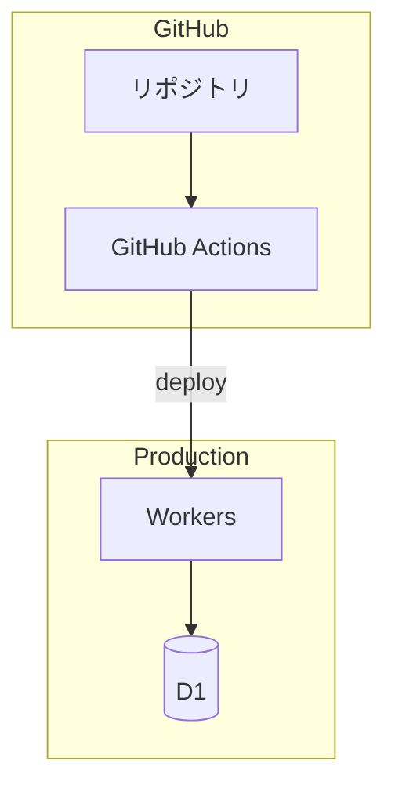

# DESIGN_DETAIL_INFRA.md テンプレート (インフラ詳細設計)

インフラ詳細設計ドキュメントを生成する際、以下のテンプレートを使用する。

## 責務

DESIGN_DETAIL_INFRA.md は「**どう構築・運用するか**」を、開発者がこのファイルだけを見て環境構築・デプロイ設定を始められるレベルで書く。対象は**変更に IaC・クラウドコンソール操作・環境設定変更が要るもの**すべて (リソース定義・CI/CD・監視・シークレット)。リポジトリ内のコード変更で完結するものは `DESIGN_DETAIL_APP.md` の責務。

CI/CD は **GitHub Actions 固定** (選定は行わない。workflow の構成を書く)。図はすべて **Mermaid** で書く (構成図 = `flowchart`)。

## テンプレート

```markdown
# [プロジェクト名] インフラ詳細設計 (DESIGN_DETAIL_INFRA.md)

生成日: [日付]
ジェネレーター: dev-spec (analyzing-requirements)
概要設計: [DESIGN.md](./DESIGN.md) / アプリ詳細: [DESIGN_DETAIL_APP.md](./DESIGN_DETAIL_APP.md)

## 目次

- [1. インフラ構成図](#1-インフラ構成図)
- [2. リソース定義](#2-リソース定義)
- [3. IaC](#3-iac)
- [4. CI/CD パイプライン (GitHub Actions)](#4-cicd-パイプライン-github-actions)
- [5. シークレット・環境変数管理](#5-シークレット環境変数管理)
- [6. 監視・アラート](#6-監視アラート)
- [7. スケーリング・可用性](#7-スケーリング可用性)
- [8. コスト概算](#8-コスト概算)
- [9. 検証手順](#9-検証手順)

## 1. インフラ構成図

[環境ごと (production / staging 等) のリソースと接続関係を Mermaid flowchart で]



## 2. リソース定義

[環境 × リソースの一覧。プロビジョニング手順 (初回のみの手作業があれば明記)]

| リソース | 環境 | スペック / プラン | プロビジョニング方法 |
|---|---|---|---|
| [Workers 等] | production | [プラン名] | [wrangler.toml / Terraform / コンソール手作業] |

### ネットワーク設計

[VPC / ファイアウォール / カスタムドメイン / DNS が該当する場合のみ。無ければ「該当なし (理由)」]

### データストア運用

[バックアップ方式と頻度、リストア手順、保持期間。スキーマ定義・マイグレーションのコード自体は DESIGN_DETAIL_APP.md]

## 3. IaC

- ツール: [wrangler.toml / Terraform / CDK 等]
- 管理対象と除外: [IaC で管理するリソース / コンソール手作業とする例外とその理由]
- state 管理: [Terraform の場合。remote state の置き場所]
- ディレクトリ構成: [例: `infra/` 配下の構成]

## 4. CI/CD パイプライン (GitHub Actions)

### workflow 一覧

| ファイル | トリガー | ジョブ | 概要 |
|---|---|---|---|
| `.github/workflows/ci.yml` | push / PR | lint → typecheck → test → build | 品質ゲート (テストの中身は DESIGN_DETAIL_APP.md のテスト戦略に従う) |
| `.github/workflows/deploy.yml` | [main への push / tag / 手動] | deploy | [デプロイ先] へのデプロイ |

### デプロイフロー

[Mermaid flowchart または番号付き手順で: どのブランチ / イベントがどの環境に届くか、承認ステップの有無、ロールバック手順]

### 環境 (GitHub Environments)

[production / preview 等の Environment 定義と protection rule (承認者・ブランチ制限)]

## 5. シークレット・環境変数管理

| 名前 | 種別 (secret / var) | 置き場所 | 用途 |
|---|---|---|---|
| [API_KEY 等] | secret | GitHub Secrets / [Workers Secrets 等] | [用途] |

- ローカル開発での扱い: [例: `.dev.vars` (gitignore 済み) に置く。サンプルは `.dev.vars.example` を track]
- ローテーション方針: [必要な場合のみ]

## 6. 監視・アラート

- 収集基盤: [例: Workers Analytics / Sentry / CloudWatch。アプリ側のログ出力フォーマットは DESIGN_DETAIL_APP.md]
- アラート条件: [メトリクス × 閾値 × 継続時間。例: 5xx rate > 1% が 5 分継続]
- 通知先: [例: Slack #alerts チャンネル、メール]

## 7. スケーリング・可用性

- スケール方式: [自動 (プラットフォーム任せ) / 水平 / 垂直、トリガー条件]
- 可用性目標と根拠: [稼働率目標。DESIGN.md のインフラ概要と整合させる]
- 障害復旧: [RTO / RPO、リストア手順への参照]

## 8. コスト概算

| リソース | 単価 | 想定使用量 | 月額概算 |
|---|---|---|---|
| [名前] | [$x / 単位] | [量] | [$y] |

[無料枠で収まる場合はその根拠を書く]

## 9. 検証手順

[DESIGN.md のゴールのうち、**デプロイ・環境依存系** (ステージング / 本番でしか確認できないもの) をここに書く (1:1 対応)。ローカル / CI 実行系は DESIGN_DETAIL_APP.md の「検証手順」へ]

- G[n] 検証: [例: `gh workflow run deploy.yml --ref main` 後、`curl https://[本番URL]/health` が 200 を返す]
- G[m] 検証 (手動): [例: preview 環境の URL にアクセスして動作確認]

[インフラ構築自体の完了確認も書く:]

- IaC 検証: [例: `terraform plan` が差分 0 / `wrangler deploy --dry-run` が成功]
- CI 検証: [例: PR 作成で ci.yml が起動し全ジョブ green]
```

## 記入基準

- インフラ構成に関する未確定要素は `<!-- POC_NEEDED: id=..., scope=..., risk=..., blocker=false -->` マーカーで該当セクションに残す (書式と運用は `analyzing-requirements.md` 参照)
- インフラが薄い構成 (単一マネージドサービスにデプロイするだけ等) でも本ファイルは省略しない。該当しないセクションに「該当なし (理由)」を明記し、最低限「4. CI/CD パイプライン」「5. シークレット・環境変数管理」「9. 検証手順」は埋める
- 表の単価・スペック列には単位を書く ($ / 月、GB 等)
