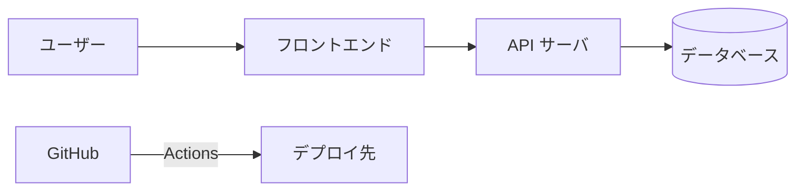

# DESIGN.md テンプレート (概要設計)

概要設計ドキュメントを生成する際、以下のテンプレートを使用する。

## 責務

DESIGN.md は**概要設計 1 本**で、「何を作るか」を全読者 (人間・実装ループ) に伝える入口。共通 / アプリケーション概要 / インフラ概要の 3 章構成とし、実装・構築レベルの詳細は書かない (詳細は `DESIGN_DETAIL_APP.md` / `DESIGN_DETAIL_INFRA.md` へリンクする)。

アプリ / インフラの境界基準: **「変更に IaC・クラウドコンソール操作・環境設定変更が要るか」**。要るならインフラ、要らない (リポジトリ内のコード変更で完結する) ならアプリ。

図はすべて **Mermaid** で書く (全体構成図 = `flowchart`、ER 概要 = `erDiagram`)。「概念図」のような記法未指定の指示は使わない。

## テンプレート

```markdown
<!-- product-mode: cli|webapp -->
# [プロジェクト名] 概要設計 (DESIGN.md)

生成日: [日付]
ジェネレーター: dev-spec (analyzing-requirements)
詳細設計: [アプリ詳細 → DESIGN_DETAIL_APP.md](./DESIGN_DETAIL_APP.md) / [インフラ詳細 → DESIGN_DETAIL_INFRA.md](./DESIGN_DETAIL_INFRA.md)

## 目次

- [1. 共通](#1-共通)
  - [システム概要](#システム概要)
  - [機能要件](#機能要件)
  - [ゴール](#ゴール)
  - [全体構成図](#全体構成図)
  - [技術スタック](#技術スタック)
  - [検討した代替案](#検討した代替案)
  - [制約と前提](#制約と前提)
  - [未解決の論点 (Open Issues)](#未解決の論点-open-issues)
- [2. アプリケーション概要](#2-アプリケーション概要)
- [3. インフラ概要](#3-インフラ概要)

## 1. 共通

### システム概要

[システムの目的、解決する問題、ビジネス価値、対象ユーザー]

### 機能要件

#### 必須機能 (MUST have)
- [機能1の説明]
- [機能2の説明]

#### オプション機能 (NICE to have)
- [機能3の説明]

#### 非ゴール (やらないこと)
- [除外する機能。除外理由を 1 行で。例: リアルタイム同期はやらない (MVP では手動リロードで足りる)]

### ゴール

[dev-impl Step 5 が機械判定する。1 件 1 行・番号付き・ユーザー視点で観測可能・Yes/No 判定可能・数値があれば数値で]

- G1: [具体的かつ検証可能な記述。例: ログイン画面でメール+パスワード入力後、3 秒以内にダッシュボードへ遷移する]
- G2: [具体的かつ検証可能な記述]
- G_E2E: [必須・省略不可。webapp: 全 UC が実機ブラウザで URL 直叩きせず UI 操作のみで通しで再現できる / cli: 全 UC がビルド済みバイナリをシェルから実行し、コマンド・フラグ・標準入出力のみで通しシナリオとして再現できる]

[各ゴールの検証手順は DESIGN_DETAIL_APP.md (自動テスト・ローカル/CI 実行系) または DESIGN_DETAIL_INFRA.md (デプロイ・環境依存系) の「検証手順」に 1:1 で書く]

### 全体構成図

[アプリとインフラを 1 枚で俯瞰する Mermaid flowchart。ユーザー → フロントエンド → API → DB / 外部サービス、およびデプロイ先・CI/CD の流れ]



### 技術スタック

| 区分           | 技術                          | 選定理由 |
| -------------- | ----------------------------- | -------- |
| フロントエンド | [React 等]                    | [理由]   |
| バックエンド   | [Hono / Go 等]                | [理由]   |
| データベース   | [PostgreSQL / D1 等]          | [理由]   |
| 実行環境       | [Cloudflare Workers / AWS 等] | [理由]   |
| CI/CD          | GitHub Actions (固定)         | —        |

### 検討した代替案

[間違えたときのコストが高い決定 (後戻りが困難・影響範囲が広いもの) のみ記録する。数時間で直せる些細な選択は記録しない]

| 決定事項 | 採用案 | 却下案 | 却下理由 |
| -------- | ------ | ------ | -------- |
| [例: データストア] | [例: PostgreSQL] | [例: DynamoDB] | [例: 複雑なリレーショナルクエリが多く、JOIN の書きやすさを優先した] |

該当する決定がなければ「該当なし」と明記する。

### 制約と前提

- 技術的制約: [使用する技術の制約]
- ビジネス制約: [予算、期間、リソース等]
- 依存関係: [外部サービスやライブラリへの依存]

### 未解決の論点 (Open Issues)

[技術検証系の未確定要素は POC_NEEDED / POC_STATUS マーカーで管理するためここには書かない。ここに書くのはビジネス判断待ちなど非技術の未決定事項]

- OI1: [論点。例: 無料プランの利用上限は未確定] (判断者: [ユーザー/実装時], ブロックする対象: [フェーズ名/UC名/なし])

該当する論点がなければ「なし」と明記する。

## 2. アプリケーション概要

[実装レベルの詳細 (API・スキーマ・エラー戦略・実装ガイド) は [DESIGN_DETAIL_APP.md](./DESIGN_DETAIL_APP.md) へ]

### 主要コンポーネントと責務

[コンポーネント一覧と 1 行責務。レイヤーアーキテクチャ (プレゼンテーション / ビジネスロジック / データアクセス) と依存の方向]

### 主要エンティティ一覧

[エンティティ名 + 1 行説明のみ。フィールド詳細は DESIGN_DETAIL_APP.md へ]


### 非機能要件 (アプリ)

- パフォーマンス目標: [レスポンスタイム p95 等、具体的な数値]
- セキュリティ方針: [認証方式、認可方式、入力検証の方向性]

### テスト戦略 (方針)

- テストピラミッド比率: [単体 / 統合 / E2E の役割分担]
- カバレッジ目標: [ライン / ブランチ / 重要パス]

## 3. インフラ概要

[構築レベルの詳細 (リソース定義・IaC・workflow・監視閾値) は [DESIGN_DETAIL_INFRA.md](./DESIGN_DETAIL_INFRA.md) へ]

### 実行環境とデプロイ先

[本番 / ステージング / 開発環境の構成。例: Cloudflare Workers + D1、環境は production / preview の 2 面]

### 主要インフラリソース一覧

| リソース     | 用途   | 管理方法 (IaC / コンソール / CLI) |
| ------------ | ------ | --------------------------------- |
| [Workers 等] | [用途] | [wrangler.toml 等]                |

### CI/CD 方針

GitHub Actions を使用する (固定)。[トリガー方針とデプロイフローの概要。workflow の具体構成は DESIGN_DETAIL_INFRA.md へ]

### 非機能要件 (インフラ)

- 可用性・信頼性: [稼働率目標、バックアップ方針、RTO / RPO]
- スケーラビリティ方針: [水平 / 垂直、負荷分散]
- 監視方針: [何を監視するかの方向性。閾値・通知先は DESIGN_DETAIL_INFRA.md へ]
```

## 記入基準

- 各章はこのファイル内で完結して読める粒度に保ち、「詳細は別途確認」を単独で残さない (リンク先を必ず明示する)
- 数値列には単位を書く (例: 200ms、99.9%)
- インフラが薄い構成 (単一マネージドサービス等) でも 3 章構成は維持し、該当しない項目は「該当なし (理由)」と明記する (無言で省略しない)
- **記載範囲は「間違えたときのコストが高い決定」に絞る**: 後から変更するコストが高い決定 (データストア選定・API の外部契約・認証方式・データ保持ポリシー等) だけを検討した代替案・非ゴール・未解決の論点に書く。数時間で直せる些細な選択 (UI 細部・命名・ページネーション方式等) は書かない (実装時に決めればよい)
