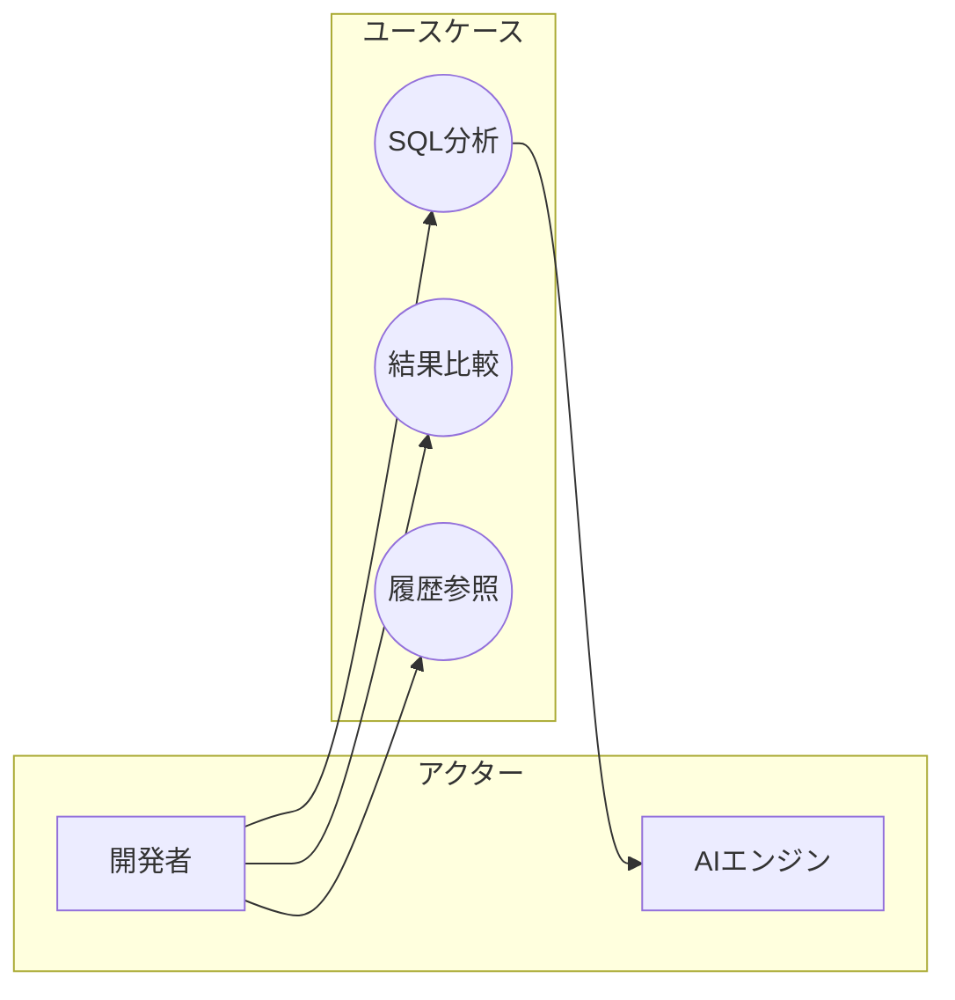

# ユースケース記述テンプレート

## ドキュメント構造

```markdown
# ユースケース記述

## UC-001: [ユースケース名]

### 概要
| 項目 | 内容 |
|------|------|
| ユースケースID | UC-001 |
| ユースケース名 | [名前] |
| 主アクター | [主アクター] |
| 副アクター | [副アクター] |
| トリガー | [ユースケースを開始するきっかけ] |

### 事前条件
- [条件1]
- [条件2]

### 事後条件
- [状態1]
- [状態2]

### 正常系フロー
| # | アクター | アクション |
|---|----------|-----------|
| 1 | [アクター] | [アクション] |
| 2 | [システム] | [応答/処理] |
| 3 | [アクター] | [アクション] |
| ... | ... | ... |

### 代替フロー
#### A: [代替フロー名]（ステップXの代替）
| # | アクター | アクション |
|---|----------|-----------|
| Xa | [アクター] | [アクション] |
| Xb | [システム] | [応答] |
→ ステップYに戻る

### 例外フロー
#### E1: [例外名]（ステップX）
| # | アクター | アクション |
|---|----------|-----------|
| Xa | [システム] | [エラー検知] |
| Xb | [システム] | [エラー処理] |

### ビジネスルール
| ID | ルール |
|----|--------|
| BR-001 | [ルール内容] |
| BR-002 | [ルール内容] |

### 関連ユーザーストーリー
- US-XXX: [ストーリー名]
```

## 記述例

```markdown
# ユースケース記述

## UC-001: SQLを分析して改善案を得る

### 概要
| 項目 | 内容 |
|------|------|
| ユースケースID | UC-001 |
| ユースケース名 | SQLを分析して改善案を得る |
| 主アクター | 開発者 |
| 副アクター | AIエンジン |
| トリガー | 開発者がスロークエリを改善したいとき |

### 事前条件
- ユーザーがログイン済みである
- プロジェクトが選択されている

### 事後条件
- 改善案が表示されている
- 分析履歴が保存されている

### 正常系フロー
| # | アクター | アクション |
|---|----------|-----------|
| 1 | 開発者 | SQLを入力する |
| 2 | 開発者 | スキーマを入力する |
| 3 | 開発者 | 「分析」ボタンをクリックする |
| 4 | システム | AIエンジンに改善案を要求する |
| 5 | AIエンジン | 改善案を3つ返す |
| 6 | システム | 改善案を一覧表示する |

### 代替フロー
#### A: スキーマをファイルからインポート（ステップ2の代替）
| # | アクター | アクション |
|---|----------|-----------|
| 2a | 開発者 | 「インポート」をクリック |
| 2b | システム | ファイル選択ダイアログを表示 |
| 2c | 開発者 | DDLファイルを選択 |
| 2d | システム | スキーマをパースして反映 |
→ ステップ3に戻る

### 例外フロー
#### E1: AIエンジンタイムアウト（ステップ4）
| # | アクター | アクション |
|---|----------|-----------|
| 4a | システム | 30秒待っても応答なし |
| 4b | システム | 「処理中」メッセージを表示 |
| 4c | システム | バックグラウンドで継続 |
| 4d | システム | 完了後メールで通知 |

### ビジネスルール
| ID | ルール |
|----|--------|
| BR-001 | 1回の分析で最大10クエリまで |
| BR-002 | スキーマサイズは100KB以下 |

### 関連ユーザーストーリー
- US-001: SQLを入力できる
- US-002: 改善案を表示できる
```

## ユースケース図（Mermaid）


