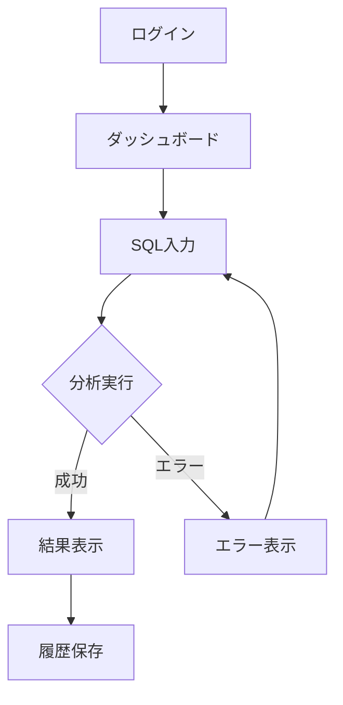

# UI/UXスケッチ

## 概要

対話を通じてUIの方向性を整理し、以下を生成する：
1. 画面一覧
2. ユーザーフロー図（Mermaid）
3. ワイヤーフレーム（ASCII）

## ワークフロー

### フェーズ1: コンテキストの確認

対象プロダクトと既存ドキュメントを確認する。

#### 1.1 前提ドキュメントの読み込み

```javascript
Read({ file_path: "docs/USER_STORIES.md" })
Read({ file_path: "docs/PRODUCT_SPEC.md" })
```

#### 1.2 コンテキストの活用

**ファイルが存在する場合**:
- USER_STORIES.md: ユーザーが行いたい操作を把握
- PRODUCT_SPEC.md: プロダクトのスコープを把握

これらの情報を元に、必要な画面を効率的に洗い出す。

**遷移条件**: フェーズ2へ

**ファイルが存在しない場合**:
AskUserQuestionで対象プロダクトを確認。

```javascript
AskUserQuestion({
  questions: [
    {
      question: "どのプロダクト/機能のUIをスケッチしますか？",
      header: "対象",
      options: [
        { label: "プロダクトを入力", description: "対象のプロダクトや機能領域" }
      ],
      multiSelect: false
    }
  ]
})
```

**遷移条件**: コンテキストが把握できたらフェーズ2へ

### フェーズ2: 画面の洗い出し

必要な画面を特定する。

**質問パターン**:
- 「ユーザーが最初に見る画面は？」
- 「主要な操作をする画面は？」
- 「設定や管理をする画面は？」
- 「エラーや確認のための画面は？」

```javascript
AskUserQuestion({
  questions: [
    {
      question: "このプロダクトに必要な画面をすべて挙げてください",
      header: "画面一覧",
      options: [
        { label: "画面を入力", description: "例: ログイン、ダッシュボード、SQL入力、結果表示" }
      ],
      multiSelect: false
    }
  ]
})
```

#### 画面の分類

| 種類 | 説明 | 例 |
|------|------|-----|
| **認証系** | ログイン、登録、パスワードリセット | ログイン画面 |
| **メイン機能** | コア機能を実行する | SQL入力画面 |
| **結果表示** | 処理結果を表示 | 改善案一覧 |
| **設定系** | ユーザー設定、プロフィール | アカウント設定 |
| **管理系** | 管理者向け | ユーザー管理 |
| **補助系** | ヘルプ、エラー | 404ページ |

**遷移条件**: 主要な画面が5-15個出たらフェーズ3へ

### フェーズ3: ユーザーフローの整理

画面間の遷移を整理する。

**質問パターン**:
- 「この画面から次にどこへ行けますか？」
- 「この操作が成功したらどの画面に遷移しますか？」
- 「エラーの場合はどうなりますか？」

```javascript
AskUserQuestion({
  questions: [
    {
      question: "主要なユーザーフロー（画面遷移）を教えてください\n\n例: ログイン → ダッシュボード → SQL入力 → 結果表示",
      header: "ユーザーフロー",
      options: [
        { label: "フローを入力", description: "画面A → 画面B → 画面C" }
      ],
      multiSelect: false
    }
  ]
})
```

#### フロー図の生成（Mermaid）



**遷移条件**: 主要フローが整理できたらフェーズ4へ

### フェーズ4: 各画面の要素整理

各画面に必要な要素を洗い出す。

```javascript
AskUserQuestion({
  questions: [
    {
      question: "[画面名]に必要な要素は何ですか？",
      header: "画面要素",
      options: [
        { label: "要素を入力", description: "例: 入力欄、ボタン、テーブル、グラフ" }
      ],
      multiSelect: false
    }
  ]
})
```

#### 要素の種類

| 種類 | 説明 | 例 |
|------|------|-----|
| **入力** | テキスト、セレクト、チェックボックス | SQL入力欄 |
| **アクション** | ボタン、リンク | 「分析」ボタン |
| **表示** | テキスト、テーブル、リスト | 改善案リスト |
| **ナビ** | メニュー、タブ、パンくず | サイドバー |
| **フィードバック** | アラート、トースト、モーダル | 成功メッセージ |

**遷移条件**: 主要画面の要素が整理できたらフェーズ5へ

### フェーズ5: ワイヤーフレーム作成

ASCIIアートでワイヤーフレームを作成する。

#### ワイヤーフレームテンプレート

```
┌─────────────────────────────────────────┐
│ ヘッダー                    [ユーザー名] │
├─────────────────────────────────────────┤
│        │                                │
│  サイド │  メインコンテンツ              │
│  バー   │                                │
│        │  ┌─────────────────────────┐   │
│  [項目1]│  │                         │   │
│  [項目2]│  │     コンテンツエリア     │   │
│  [項目3]│  │                         │   │
│        │  └─────────────────────────┘   │
│        │                                │
│        │  [アクションボタン]            │
│        │                                │
├─────────────────────────────────────────┤
│ フッター                                │
└─────────────────────────────────────────┘
```

#### SQL入力画面の例

```
┌─────────────────────────────────────────┐
│ DBTune                      [user@mail] │
├─────────────────────────────────────────┤
│        │                                │
│ 履歴   │  SQL入力                       │
│ 設定   │  ┌─────────────────────────┐   │
│        │  │ SELECT * FROM users     │   │
│        │  │ WHERE ...               │   │
│        │  │                         │   │
│        │  └─────────────────────────┘   │
│        │                                │
│        │  スキーマ（任意）              │
│        │  ┌─────────────────────────┐   │
│        │  │ CREATE TABLE users ...  │   │
│        │  └─────────────────────────┘   │
│        │                                │
│        │  [分析する]                    │
│        │                                │
└─────────────────────────────────────────┘
```

**遷移条件**: 主要画面のワイヤーフレームが作成できたらフェーズ6へ

### フェーズ6: インタラクションの整理

画面上のインタラクションを定義する。

```javascript
AskUserQuestion({
  questions: [
    {
      question: "この画面でユーザーが行う主要な操作と、その結果を教えてください",
      header: "インタラクション",
      options: [
        { label: "操作を入力", description: "例: ボタンクリック → モーダル表示" }
      ],
      multiSelect: false
    }
  ]
})
```

#### インタラクション定義

| トリガー | アクション | 結果 |
|----------|-----------|------|
| 「分析」ボタンクリック | API呼び出し | ローディング → 結果表示 |
| SQL入力欄フォーカスアウト | バリデーション | エラー表示 or 正常 |
| 履歴項目クリック | SQLを入力欄にロード | 入力欄が更新される |

**遷移条件**: 主要なインタラクションが定義できたらフェーズ7へ

### フェーズ7: ドキュメント生成

```markdown
# UI/UXスケッチ

## 画面一覧

| 画面名 | 種類 | 説明 |
|--------|------|------|
| ログイン | 認証系 | ユーザー認証 |
| ダッシュボード | メイン | トップページ |
| SQL入力 | メイン機能 | クエリ入力と分析実行 |
| 結果表示 | 結果表示 | 改善案の一覧 |

## ユーザーフロー

### メインフロー

[Mermaid図]

### 代替フロー

...

## ワイヤーフレーム

### ログイン画面

[ASCIIワイヤーフレーム]

**要素**:
- メールアドレス入力欄
- パスワード入力欄
- 「ログイン」ボタン
- 「パスワードを忘れた」リンク

**インタラクション**:
| トリガー | アクション | 結果 |
|----------|-----------|------|
| ログインボタン | 認証API | 成功→ダッシュボード / 失敗→エラー表示 |

### SQL入力画面

[ASCIIワイヤーフレーム]

...

## デザイン方針（メモ）

- シンプルで直感的なUI
- 開発者向けのダークモード対応
- モバイル非対応（デスクトップ優先）
```

### 出力ファイル

```javascript
Write({
  file_path: "docs/UI_SKETCH.md",
  content: uiSketchContent
})
```

### フェーズ8: セルフレビュー（サブエージェント）

生成したドキュメントのレビューをサブエージェントに委譲する。

```javascript
Task({
  description: "UI/UXスケッチレビュー",
  subagent_type: "general-purpose",
  prompt: `
以下のUI/UXスケッチドキュメントをレビューし、問題があれば修正してください。

## レビュー対象ファイル
- docs/UI_SKETCH.md

## レビュー観点

1. **画面の網羅性**: 必要な画面がすべてリストアップされているか
2. **フローの完全性**: ユーザーフローに抜け漏れがないか
3. **ワイヤーフレームの明確さ**: 各画面の要素が明確に配置されているか
4. **インタラクションの定義**: 主要な操作と結果が定義されているか
5. **一貫性**: 画面間でUI要素やナビゲーションが一貫しているか
6. **ユーザビリティ**: 直感的で使いやすい設計になっているか

## 出力形式

1. 発見した問題のリスト（問題がない場合は「問題なし」）
2. 各問題の修正内容
3. 修正後のファイル更新（Editツールで修正）

問題がなくなるまでレビューと修正を繰り返すこと。
`
})
```

## 完了条件

- [ ] 画面一覧が作成されている
- [ ] ユーザーフローがMermaidで図示されている
- [ ] 主要画面のワイヤーフレームが作成されている
- [ ] 各画面の要素が整理されている
- [ ] インタラクションが定義されている
- [ ] UI_SKETCH.mdが生成されている
- [ ] セルフレビューが完了し、問題が解消されている

## 関連スキル

- **user-story**: UIスケッチの前にストーリーを作成する場合
- **usecase-description**: より詳細なフローを整理する場合
- **analyzing-requirements**: 技術設計に進む場合
