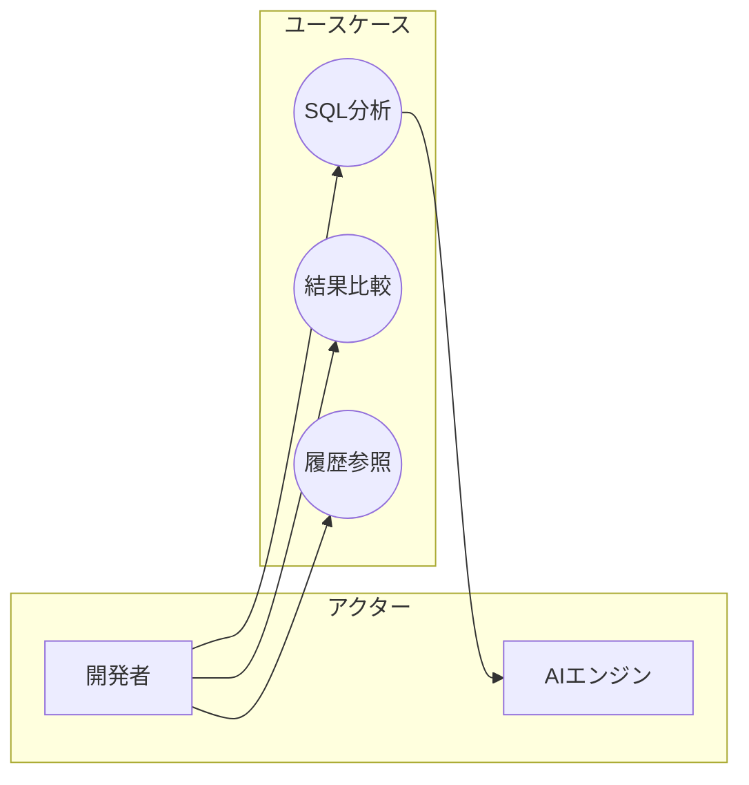

# ユースケース記述

## 概要

ユーザーストーリーを詳細化し、以下を生成する：
1. ユースケース記述（正常系/異常系/代替フロー）
2. ビジネスルール一覧
3. ユースケース図（Mermaid）

## 参照ドキュメント

- **ユースケース記述ガイド**: [references/usecase-guide.md](references/usecase-guide.md)
  - 読み込みタイミング: フェーズ3で正常系フローを記述する時

## ワークフロー

### フェーズ1: 対象ストーリーの選択

詳細化するユーザーストーリーを特定する。

#### 1.1 前提ドキュメントの読み込み

```javascript
Read({ file_path: "docs/USER_STORIES.md" })
```

#### 1.2 コンテキストの活用

**ファイルが存在する場合**:
USER_STORIES.mdからストーリー一覧を読み込み、詳細化するストーリーを選択。

```javascript
AskUserQuestion({
  questions: [
    {
      question: "どのユーザーストーリーを詳細化しますか？（複数選択可）",
      header: "対象ストーリー",
      options: [
        { label: "ストーリーを選択", description: "読み込んだストーリーから選択" }
      ],
      multiSelect: true
    }
  ]
})
```

**遷移条件**: フェーズ2へ

**ファイルが存在しない場合**:
AskUserQuestionで詳細化するストーリーを確認。

```javascript
AskUserQuestion({
  questions: [
    {
      question: "詳細化したいユーザーストーリーを入力してください。",
      header: "対象ストーリー",
      options: [
        { label: "ストーリーを入力", description: "詳細化したいストーリーを記述" }
      ],
      multiSelect: false
    }
  ]
})
```

**遷移条件**: 対象ストーリーが特定できたらフェーズ2へ

### フェーズ2: アクターの特定

ユースケースに関わるアクターを洗い出す。

```javascript
AskUserQuestion({
  questions: [
    {
      question: "このユースケースに関わるアクター（人、システム）は誰ですか？",
      header: "アクター",
      options: [
        { label: "アクターを入力", description: "例: 開発者、AIエンジン、外部DB" }
      ],
      multiSelect: false
    }
  ]
})
```

#### アクターの種類

| 種類           | 説明                   | 例                       |
| -------------- | ---------------------- | ------------------------ |
| **主アクター** | ユースケースを開始する | 開発者                   |
| **副アクター** | ユースケースに協力する | AIエンジン、決済システム |

**遷移条件**: アクターが特定できたらフェーズ3へ

### フェーズ3: 正常系フローの記述

ユースケースの基本フロー（ハッピーパス）を記述する。

**質問パターン**:
- 「最初に何をしますか？」
- 「次に何が起こりますか？」
- 「システムはどう応答しますか？」
- 「最終的にどうなったら成功ですか？」

```javascript
AskUserQuestion({
  questions: [
    {
      question: "このユースケースの正常な流れをステップバイステップで教えてください。",
      header: "正常系フロー",
      options: [
        { label: "フローを入力", description: "1. xxx 2. xxx 3. xxx" }
      ],
      multiSelect: false
    }
  ]
})
```

#### フロー記述のフォーマット

```
1. [アクター] が [アクション] する
2. [システム] が [応答/処理] する
3. [アクター] が [アクション] する
4. [システム] が [結果] を表示する
```

**例**:
```
1. 開発者がSQLを入力する
2. 開発者がスキーマを入力する
3. 開発者が「分析」ボタンをクリックする
4. システムがAIエンジンに改善案を要求する
5. AIエンジンが改善案を3つ返す
6. システムが改善案を一覧表示する
```

**遷移条件**: 正常系フローが5-10ステップで記述できたらフェーズ4へ

### フェーズ4: 事前条件・事後条件の定義

ユースケースの開始条件と終了状態を明確にする。

```javascript
AskUserQuestion({
  questions: [
    {
      question: "このユースケースを開始するための条件は？（事前条件）",
      header: "事前条件",
      options: [
        { label: "条件を入力", description: "例: ログイン済み、プロジェクトを選択済み" }
      ],
      multiSelect: false
    },
    {
      question: "このユースケースが成功した後の状態は？（事後条件）",
      header: "事後条件",
      options: [
        { label: "状態を入力", description: "例: 改善案が保存されている" }
      ],
      multiSelect: false
    }
  ]
})
```

**遷移条件**: 事前・事後条件が定義できたらフェーズ5へ

### フェーズ5: 代替フローの洗い出し

正常系から分岐するパスを特定する。

**質問パターン**:
- 「ステップXで別の選択肢はありますか？」
- 「ユーザーが途中でキャンセルしたらどうなりますか？」
- 「複数の方法がある場合は？」

```javascript
AskUserQuestion({
  questions: [
    {
      question: "正常系の各ステップで、別の選択肢や分岐はありますか？",
      header: "代替フロー",
      options: [
        { label: "代替フローを入力", description: "ステップX: 〇〇の場合は△△する" }
      ],
      multiSelect: false
    }
  ]
})
```

**例**:
```
代替フロー A: ステップ2でスキーマをファイルからインポート
2a. 開発者が「インポート」ボタンをクリックする
2b. システムがファイル選択ダイアログを表示する
2c. 開発者がDDLファイルを選択する
2d. システムがスキーマをパースして入力欄に反映する
→ ステップ3に戻る
```

**遷移条件**: 主要な代替フローが洗い出せたらフェーズ6へ

### フェーズ6: 異常系（例外フロー）の洗い出し

エラーや例外的な状況を特定する。

**質問パターン**:
- 「ステップXで失敗したらどうなりますか？」
- 「入力が不正だった場合は？」
- 「外部システムが応答しなかったら？」
- 「タイムアウトしたらどうなりますか？」

```javascript
AskUserQuestion({
  questions: [
    {
      question: "どんなエラーや例外が発生し得ますか？それぞれどう対処しますか？",
      header: "異常系",
      options: [
        { label: "異常系を入力", description: "エラー: 〇〇 → 対処: △△" }
      ],
      multiSelect: false
    }
  ]
})
```

**例**:
```
例外フロー E1: ステップ4でAIエンジンがタイムアウト
4a. システムが30秒待ってもAIから応答がない
4b. システムが「処理に時間がかかっています」と表示する
4c. システムがバックグラウンドで処理を継続する
4d. 完了したらメールで通知する
```

**遷移条件**: 主要な異常系が洗い出せたらフェーズ7へ

### フェーズ7: ビジネスルールの抽出

フローの中に隠れているビジネスルールを明確にする。

**質問パターン**:
- 「〇〇できる条件は何ですか？」
- 「上限や下限はありますか？」
- 「〇〇と△△の関係にルールはありますか？」
- 「自動的に行われる処理はありますか？」

```javascript
AskUserQuestion({
  questions: [
    {
      question: "このユースケースに関連するビジネスルールや制約はありますか？",
      header: "ビジネスルール",
      options: [
        { label: "ルールを入力", description: "例: 1回の分析で最大10クエリまで" }
      ],
      multiSelect: false
    }
  ]
})
```

**例**:
```
BR-001: 1回の分析で入力できるSQLは最大10クエリまで
BR-002: スキーマサイズは100KB以下
BR-003: 改善案は最低3つ、最大10個生成する
BR-004: 無料プランは1日5回まで分析可能
```

**遷移条件**: ビジネスルールが整理できたらフェーズ8へ

### フェーズ8: ドキュメント生成

テンプレートは [references/usecase-template.md](references/usecase-template.md) を参照。

### 出力ファイル

```javascript
Write({
  file_path: "docs/USECASES.md",
  content: usecasesContent
})
```

### フェーズ9: ユースケース図の生成（オプション）



### フェーズ10: セルフレビュー（サブエージェント）

生成したドキュメントのレビューをサブエージェントに委譲する。

```javascript
Task({
  description: "ユースケースレビュー",
  subagent_type: "general-purpose",
  prompt: `
以下のユースケースドキュメントをレビューし、問題があれば修正してください。

## レビュー対象ファイル
- docs/USECASES.md

## レビュー観点

1. **正常系の完全性**: フローが開始から終了まで漏れなく記述されているか
2. **代替フローの網羅性**: 主要な分岐パスが洗い出されているか
3. **異常系の網羅性**: エラーケースが十分に考慮されているか
4. **ビジネスルールの明確さ**: 制約や条件が具体的に定義されているか
5. **事前・事後条件の妥当性**: 開始条件と終了状態が明確で矛盾がないか
6. **アクターの適切さ**: 主アクター・副アクターが適切に定義されているか

## 出力形式

1. 発見した問題のリスト（問題がない場合は「問題なし」）
2. 各問題の修正内容
3. 修正後のファイル更新（Editツールで修正）

問題がなくなるまでレビューと修正を繰り返すこと。
`
})
```

## 完了条件

- [ ] アクターが特定されている
- [ ] 正常系フローが記述されている
- [ ] 事前・事後条件が定義されている
- [ ] 代替フローが洗い出されている
- [ ] 異常系が洗い出されている
- [ ] ビジネスルールが抽出されている
- [ ] USECASES.mdが生成されている
- [ ] セルフレビューが完了し、問題が解消されている

## 関連スキル

- **user-story**: ユースケース記述の前にストーリーを作成する場合
- **ddd-modeling**: ユースケースからドメインモデルを構築する場合
- **analyzing-requirements**: 技術設計に進む場合
